# 🏗️ Arquitetura Visual - Personal Nurse Frontend

Este documento contém diagramas visuais da arquitetura do Personal Nurse para facilitar a compreensão do sistema.

---

## 📊 Diagrama de Arquitetura Geral

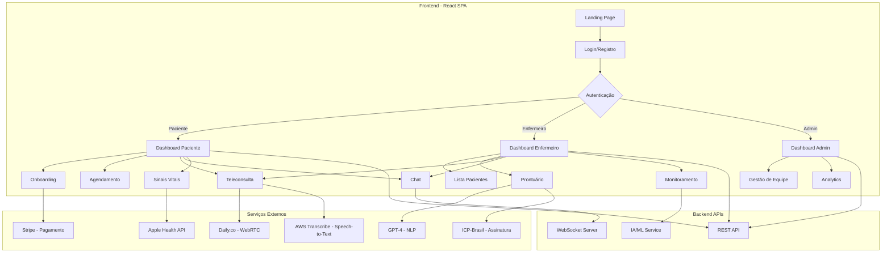

---

## 🔄 Fluxo de Dados (State Management)

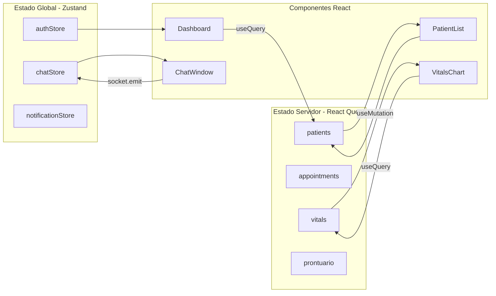

---

## 🛣️ Mapa de Rotas

```mermaid
graph TD
    A[/ - Landing] --> B[/planos - Pricing]
    A --> C[/login - Login]

    C --> D[/paciente/dashboard]
    C --> E[/enfermeiro/dashboard]
    C --> F[/admin/dashboard]

    D --> G[/paciente/onboarding/termos]
    G --> H[/paciente/onboarding/anamnese]
    H --> I[/paciente/onboarding/contrato]
    I --> J[/paciente/onboarding/pagamento]

    D --> K[/paciente/agendar]
    D --> L[/paciente/chat]
    D --> M[/paciente/sinais-vitais]

    E --> N[/enfermeiro/pacientes]
    E --> O[/enfermeiro/agenda]
    E --> P[/enfermeiro/monitoramento]

    K --> Q[/teleconsulta/:id]
    O --> Q
```

---

## 👥 Fluxo de Onboarding do Paciente

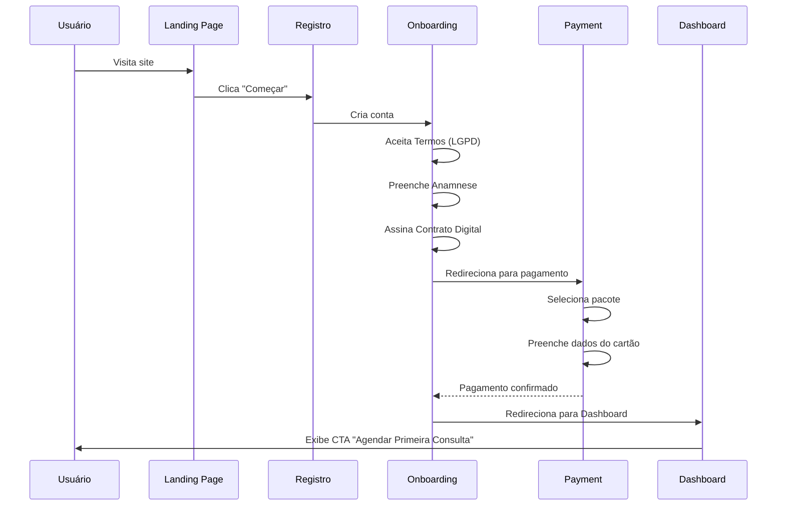

---

## 📹 Fluxo de Teleconsulta

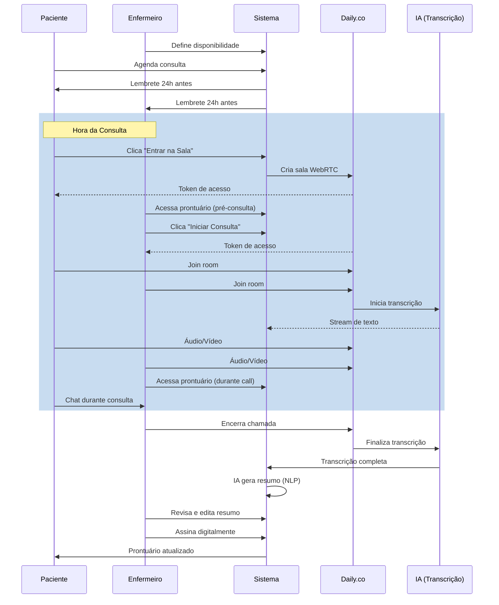

---

## 💬 Arquitetura do Chat Real-time

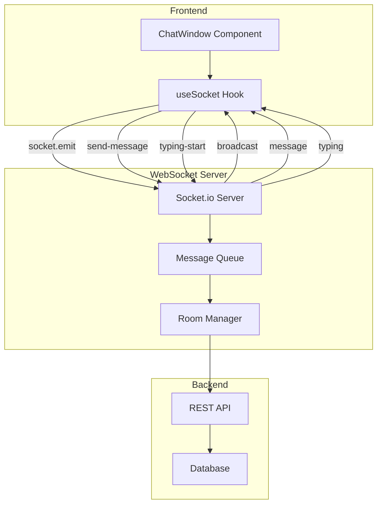

---

## 📊 Dashboard de Sinais Vitais com IA

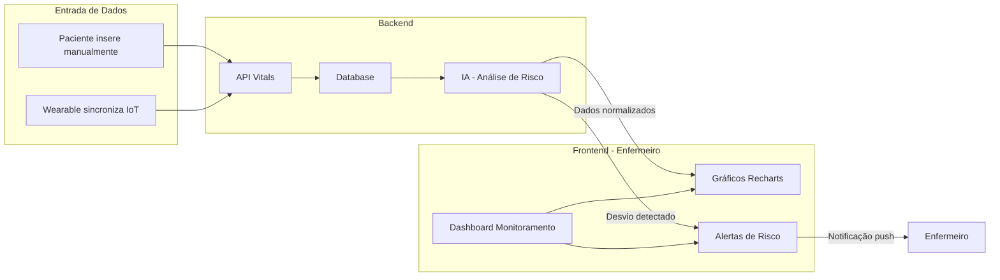

---

## 🔐 Fluxo de Assinatura Digital (ICP-Brasil)

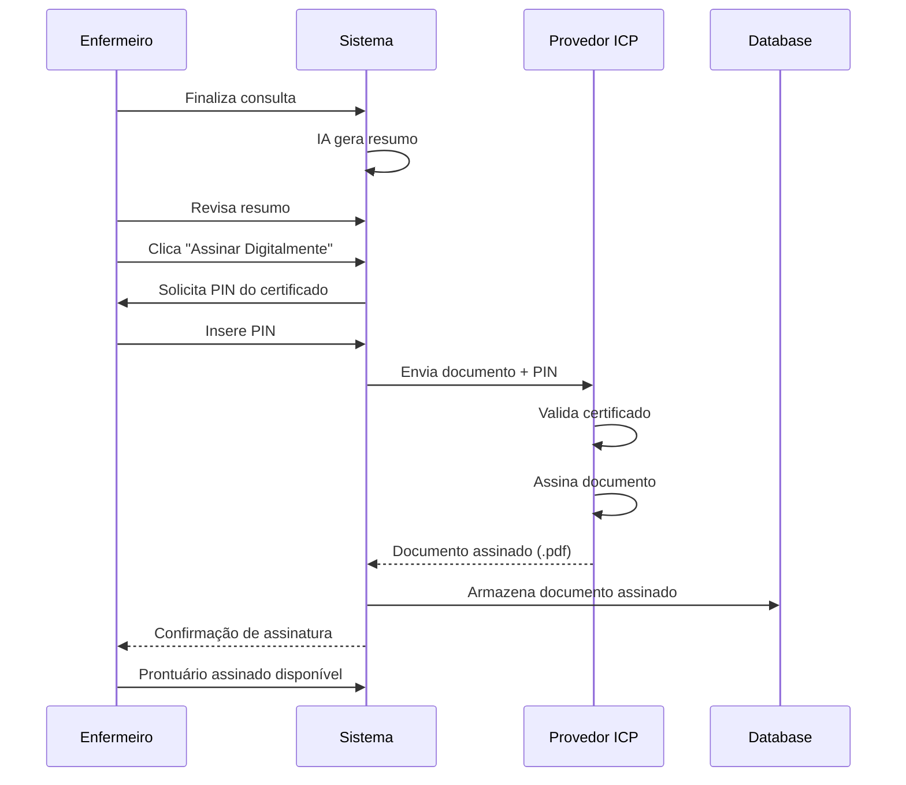

---

## 🏗️ Estrutura de Componentes (Hierarquia)

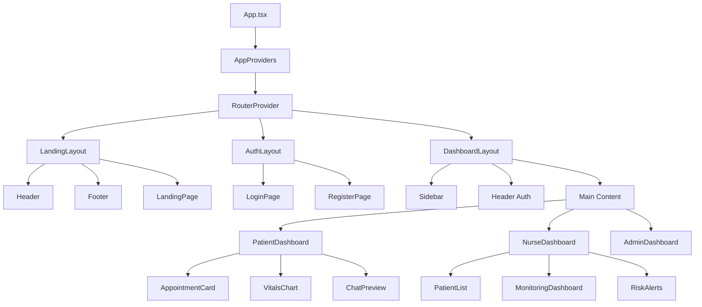

---

## 🔄 Ciclo de Vida de uma Requisição API

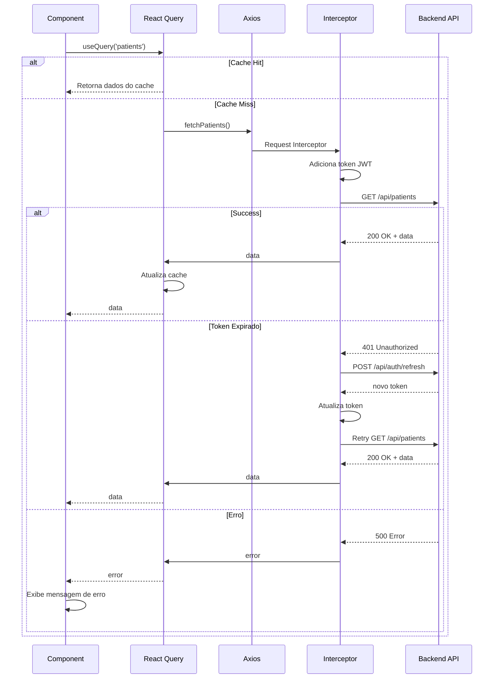

---

## 📱 Arquitetura Responsiva (Breakpoints)

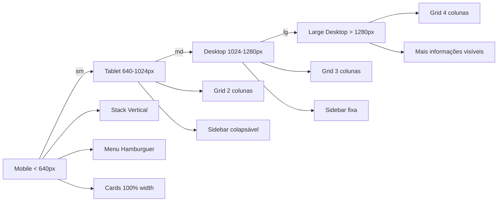

---

## 🎨 Design System (Hierarquia de Componentes)

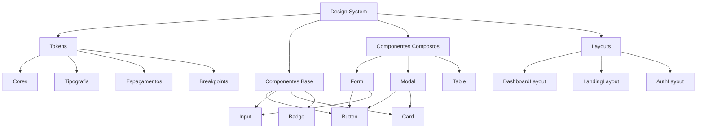

---

## 🔒 Camadas de Segurança

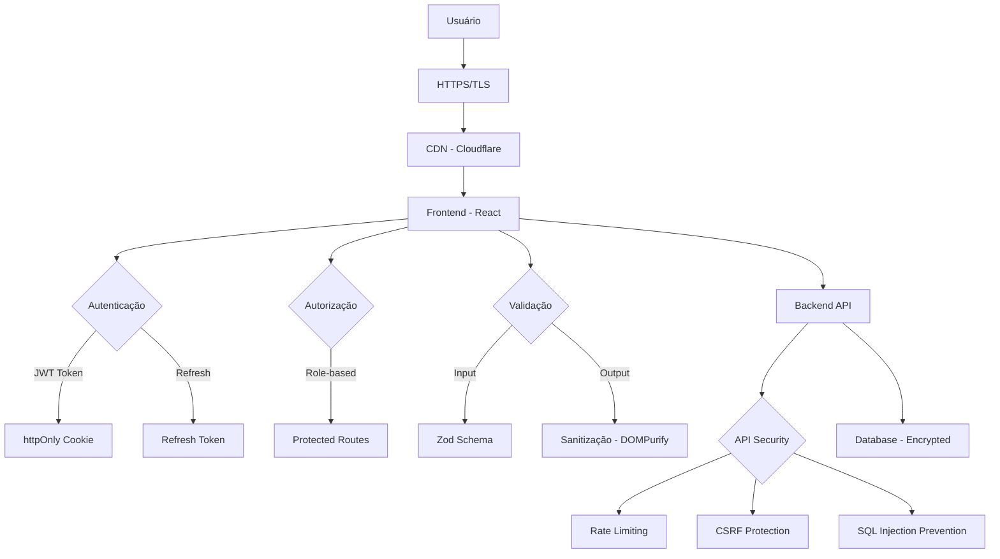

---

## 📈 Fluxo de Analytics e Monitoramento

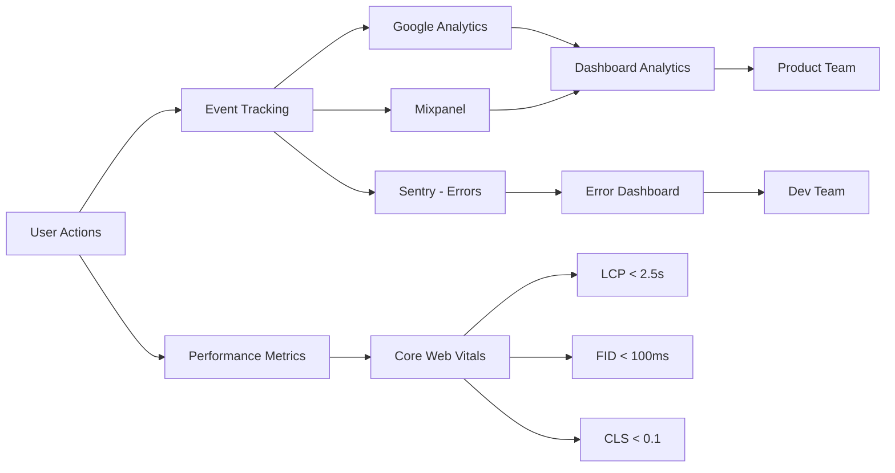

---

## 🚀 Pipeline de Deploy

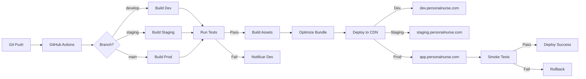

---

## 🧩 Integração de Módulos (Feature Modules)

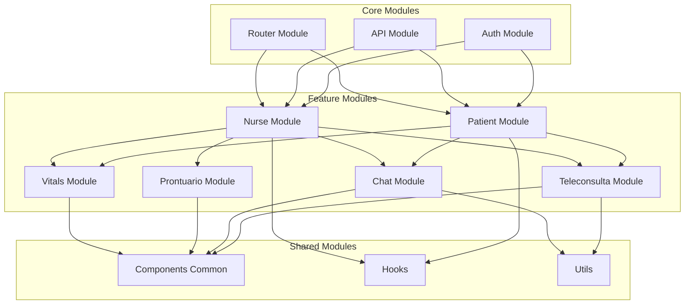

---

## 📊 Modelo de Dados (Entidades Principais)

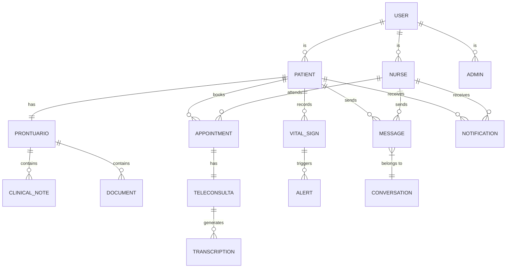

---

**Fim dos Diagramas de Arquitetura**

Estes diagramas fornecem uma visão clara e visual de como o Personal Nurse está estruturado, facilitando a compreensão do sistema por toda a equipe (desenvolvedores, designers, product owners).
